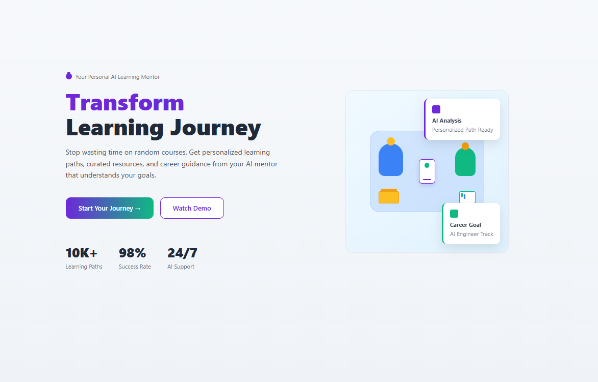
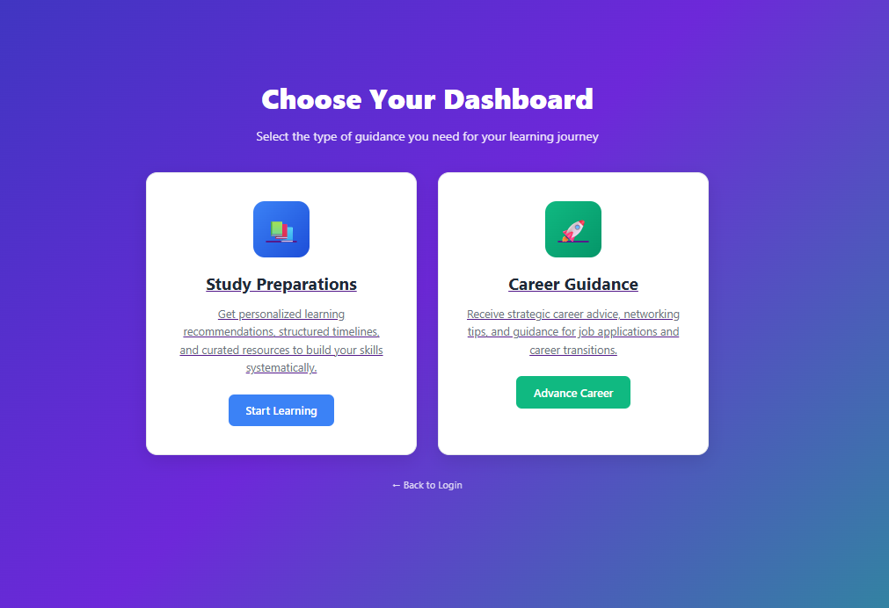

# AI Mentor Hub

**Personal AI mentor that curates resources, plans learning paths, and guides careers from A to Z.**

A comprehensive Flask web application that uses AI to generate personalized learning recommendations, create structured study schedules, and provide career guidance based on individual backgrounds and goals.

## 🚀 Quick Start

Run the application locally in minutes:

```bash
# Clone and enter
git clone https://github.com/your-username/AI-Mentor-hub.git
cd AI-Mentor-hub

# Install dependencies
pip install flask python-dotenv together

# Optional: Set up AI API key
echo "TOGETHER_API_KEY=your_api_key_here" > .env

# Run the application
python app.py
```

Visit `http://127.0.0.1:5000` to start your learning journey!

## 📋 Table of Contents

- [Features](#-features)
- [AI Integration](#-ai-integration)
- [User Flow](#-user-flow)
- [Installation](#-installation)
- [Configuration](#-configuration)
- [Project Structure](#-project-structure)
- [Tech Stack](#-tech-stack)
- [Screenshots](#-screenshots)
- [Roadmap](#-roadmap)
- [Contributing](#-contributing)

## ✨ Features

### 🎯 **Personalized Learning Roadmap**
- **AI-Powered Recommendations**: Dynamic course suggestions from top platforms (Coursera, Udemy, Khan Academy, edX)
- **Structured Learning Phases**: Foundation → Core Skills → Advanced Applications
- **Platform Integration**: Real URLs to actual courses with ratings, duration, and difficulty levels
- **Progressive Difficulty**: Beginner to advanced learning paths

### 📅 **Interactive Schedule Tracker**
- **6-Week Learning Schedule**: AI-generated realistic weekly tasks
- **Progress Tracking**: Visual progress bars and completion checkboxes
- **Task Management**: Individual task completion with week-level tracking
- **Export Functionality**: Download progress as JSON for record-keeping
- **Reset Options**: Start fresh when needed

### 🧠 **Smart Memory System**
- **User Recognition**: Remembers recommendations based on user profile
- **Persistent Storage**: Local JSON file storage for user data
- **Regeneration Options**: Users can request new recommendations anytime
- **Session Management**: Maintains user context across visits

### 🎨 **Professional UI/UX**
- **Multi-Page Flow**: Landing → Login → Dashboard Selection → Study/Career Dashboards
- **Responsive Design**: Works on desktop, tablet, and mobile
- **Modern Interface**: Clean, professional design with smooth animations
- **Feature Pages**: Detailed explanations for each AI mentor capability

## 🤖 AI Integration

### **AI Model**: Meta-Llama-3-8B-Instruct-Lite via Together AI
- **Dynamic Content Generation**: Creates personalized recommendations and schedules
- **Context Awareness**: Considers user background, goals, and recommended courses
- **Fallback System**: Works even without API key (uses curated static recommendations)
- **Smart Prompting**: Optimized prompts for educational content generation

### **AI Capabilities**:
- **Course Discovery**: Finds relevant courses across multiple learning platforms
- **Schedule Generation**: Creates realistic, achievable weekly learning plans
- **Resource Curation**: Filters and ranks educational content
- **Personalization**: Adapts recommendations based on individual profiles

## 🔄 User Flow

1. **Landing Page**: Learn about AI Mentor Hub features and capabilities
2. **Login**: Simple authentication (demo accepts any credentials)
3. **Dashboard Selection**: Choose between Study Preparations or Career Guidance
4. **Study Dashboard**: Input your background, skills, and learning goals
5. **AI Generation**: Get personalized recommendations and 6-week schedule
6. **Progress Tracking**: Track your learning progress with interactive tools
7. **Regeneration**: Request new recommendations when needed

## 🛠 Installation

### Prerequisites
- Python 3.8+
- Git
- Web browser

### Setup Steps

```bash
# 1. Clone the repository
git clone https://github.com/your-username/AI-Mentor-hub.git
cd AI-Mentor-hub

# 2. Create virtual environment (recommended)
python -m venv venv
source venv/bin/activate  # On Windows: venv\Scripts\activate

# 3. Install dependencies
pip install flask python-dotenv together

# 4. Run the application
python app.py
```

## ⚙️ Configuration

### Environment Variables
Create a `.env` file in the project root:

```env
# Optional: Together AI API Key for enhanced AI features
TOGETHER_API_KEY=your_together_api_key_here

# Flask secret key (change in production)
FLASK_SECRET_KEY=your_secret_key_here
```

### API Key Setup (Optional)
1. Sign up at [Together AI](https://together.ai/)
2. Get your API key
3. Add it to your `.env` file
4. Restart the application

**Note**: The app works without an API key using fallback recommendations.

## 📁 Project Structure

```
AI-Mentor-hub/
├── app.py                          # Main Flask application
├── templates/                       # HTML templates
│   ├── landing.html                # Landing page
│   ├── login.html                  # Login page
│   ├── dashboard_selection.html    # Dashboard selection
│   ├── study_dashboard.html        # Study preparations dashboard
│   ├── career_dashboard.html       # Career guidance dashboard
│   ├── recommendations.html        # AI-generated recommendations
│   └── feature_pages/              # Individual feature explanations
├── user_data/                      # User recommendation storage
│   └── *.json                     # User-specific data files
├── .env                           # Environment variables (create this)
├── .gitignore                     # Git ignore rules
└── README.md                      # This file
```

## 🛠 Tech Stack

### Backend
- **Flask**: Web framework
- **Python 3.8+**: Core language
- **Together AI**: LLM integration
- **JSON**: Local data storage

### Frontend
- **HTML5/CSS3**: Modern web standards
- **JavaScript**: Interactive features
- **Responsive Design**: Mobile-first approach

### AI/ML
- **Meta-Llama-3-8B-Instruct-Lite**: Language model
- **Custom Prompts**: Educational content generation
- **Context Management**: User profile integration

## 📸 Screenshots

### Landing Page

*Professional landing page with AI mentor introduction, feature highlights, and call-to-action buttons*

### Study Dashboard  

*Clean form interface for user input with real-time recommendation checking and status messages*

---

**📝 Additional Screenshots:** More screenshots will be added as the application evolves, including the recommendations page and interactive schedule tracker.

## 🗺 Roadmap

### Completed ✅
- [x] Multi-page web application
- [x] AI-powered recommendation generation
- [x] Interactive schedule tracker
- [x] User memory system
- [x] Professional UI/UX
- [x] Responsive design
- [x] Progress tracking
- [x] Export functionality

### In Progress 🚧
- [ ] Career guidance dashboard enhancement
- [ ] Advanced progress analytics
- [ ] User authentication system
- [ ] Database integration

### Planned 📋
- [ ] Mobile app development
- [ ] Social learning features
- [ ] Integration with learning platforms
- [ ] Advanced AI tutoring
- [ ] Community features
- [ ] Certification tracking

## 🤝 Contributing

We welcome contributions! Here's how you can help:

1. **Fork the repository**
2. **Create a feature branch**: `git checkout -b feature/amazing-feature`
3. **Commit your changes**: `git commit -m 'Add amazing feature'`
4. **Push to the branch**: `git push origin feature/amazing-feature`
5. **Open a Pull Request**

### Development Setup
```bash
# Install development dependencies
pip install -r requirements-dev.txt

# Run tests
python -m pytest

# Start development server
python app.py
```

## 📄 License

This project is licensed under the MIT License - see the [LICENSE](LICENSE) file for details.

## 🙏 Acknowledgments

- **Together AI** for providing the LLM infrastructure
- **Flask** community for the excellent web framework
- **Open source contributors** who made this project possible

---

**Ready to transform your learning journey?** 🚀

[Get Started](#-quick-start) | [View Features](#-features) | [Contribute](#-contributing)